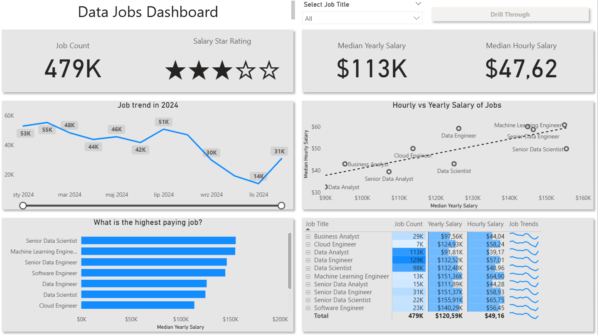
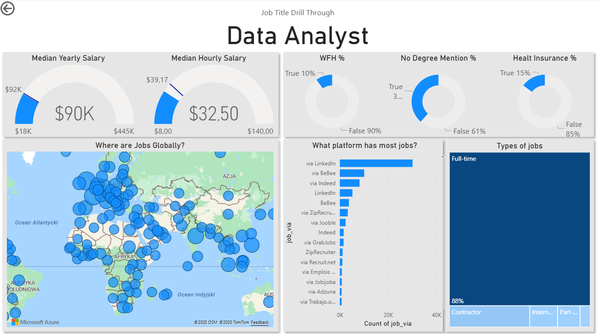

# Data Jobs Dashboard with Power BI

## Introduction
This dashboard was created with Luke Barousse [Power BI for Data Analytics Course](https://www.youtube.com/watch?v=FwjaHCVNBWA&list=WL&index=13&t=14824s&ab_channel=LukeBarousse). It presents information about the data job market in 2024.

## Skills Showcased
- Data Transformation with Power Query
- Dashboard Design
- Interactive Reporting:
    - Slicers
    - Buttons
    - Drill Through

## Dashboard Overview

### Page 1

This page showcases key KPIs like total job count, median salaries and top job titles. It gives understanding of data job market in 2024.

### Page 2

This is the deep-dive page. From the main dashboard, you can drill through to this view to get details for single job title, like salary ranges, work-from-home stats, top hiring platforms and a global map od job locations.